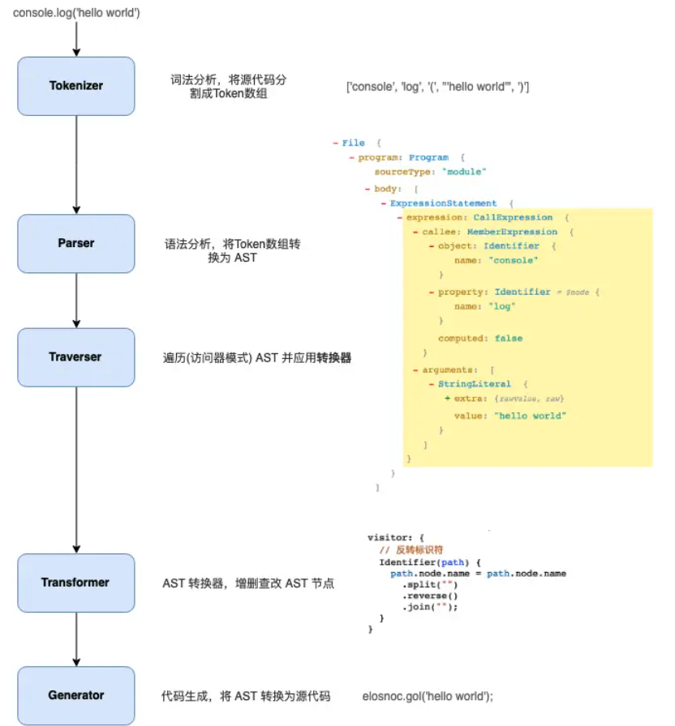
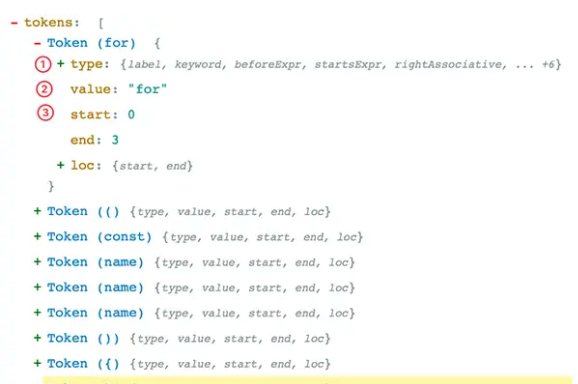
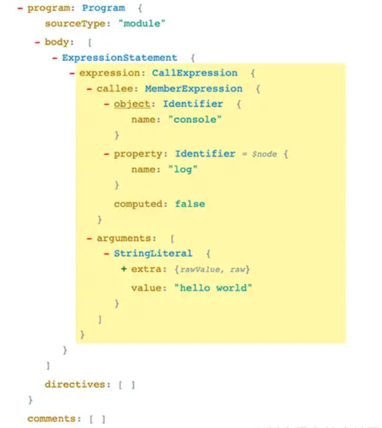

# 总结

## babel处理流程

## 词法分析

在这个阶段将字符串转换成Tokens，可以将Tokens认为是一些语法片段的数组

例如：`for (const item of items) {}`词法分析结果，方便后续语法分析

## 语法分析

这个阶段解析器会把Tokens转换成抽象语法树，也就是我们常说的AST

`console.log('hello world')`会被解析成

图中Program、CallExpression、Identifier 这些都是节点的类型，每个节点都是一个有意义的语法单元，节点类型又定义一些属性来描述节点信息

AST的节点类型很多，比如babel支持jsx、flow、ts等等各种类型的语法，可以使用[ASTExplorer](https://astexplorer.net/)来审查节点信息

## 转换Transform

这个阶段会对AST进行遍历，对节点进行增删改查，babel的所有插件都在这个阶段工作，比如语法转换，代码压缩等

## 代码生成

最后阶段还需要将AST转换成javascript，同时在这个阶段可以生成sourcemap

## 核心@babel/core

1. 加载和处理配置
2. 加载插件
3. 调用parser语法解析生成AST
4. traverser遍历AST
5. 生成代码，包括sourcemap和源代码生成
